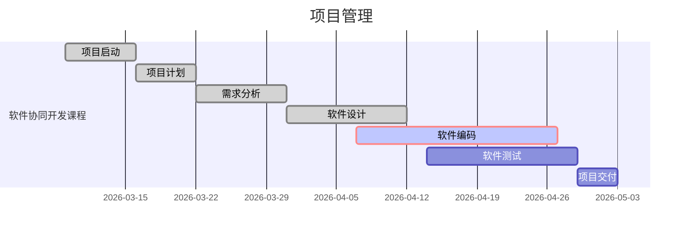
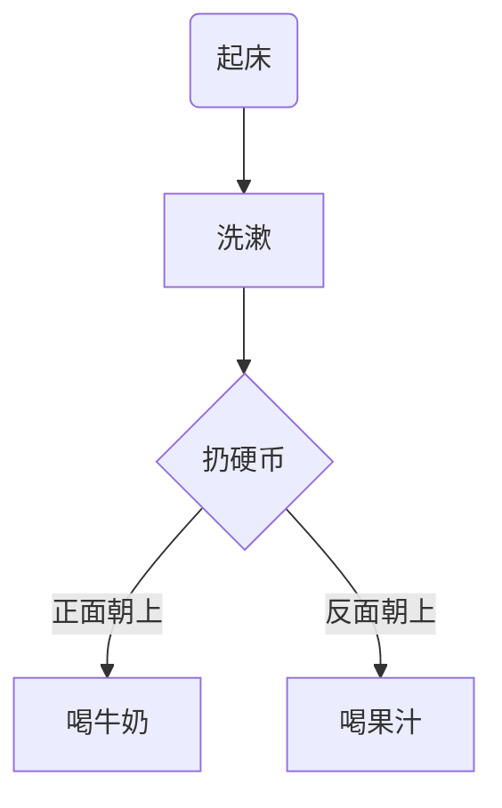
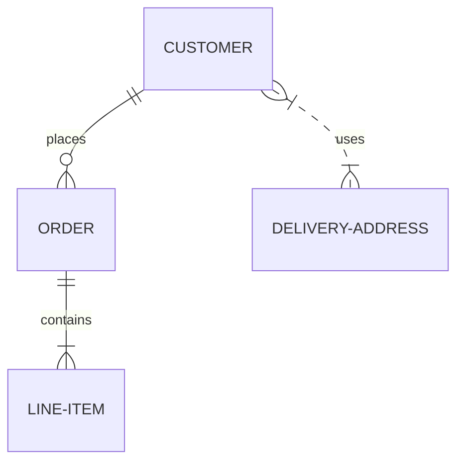
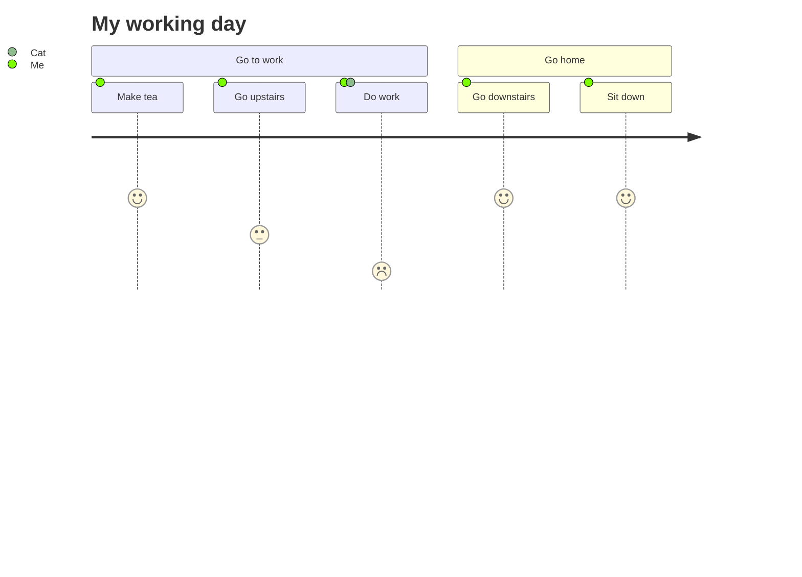

## Dendron

> 官网https://dendron.so/

我想每个知识工作者都会有自己的个人知识管理解决方案，而且也都在不断地进化和改善中，还记得最早的时候，我们是没有这些概念的，那时候，不管把信息记在哪儿，随手记下来就算了，用过之后也就忘了或者删掉了。慢慢地我们意识到一些信息可能是有用的，需要保留下来的，于是我们用各种方式进行保存，建一些文件夹，分一些目录，分门别类，把要保存的信息记录在 Word 文件中，放在这些目录里，或者是在邮箱里设置相应的目录存放邮箱里有用的邮件，或者是在微信收藏、QQ 收藏，个人云空间，QQ 文档、石墨、飞书文档等等，再后来，更有意识的人会使用商业解决方案，比如用 Evernote，One Note 等，最近热起来的 Roam research 和国内版 Roam Edit则代表了最新的双向关联的理念。

不管怎么说，都是可以解决一定范围的问题的，同时可能也会感觉到在某些方面有所不便，比如：隐私问题、自由灵活扩展问题、检索查询问题、归类整理问题、支持渐近演进问题、空间功能收费问题等，有些时候收藏就只停留在收藏的阶段，尘封之后，再很少发挥什么作用。

我个人的知识管理方案也是经历过了很多次的变化和演进，用过了很多的工具和方法，比如：各门户的博客、Evernote、印象笔记、蚂蚁笔记、有道云笔记、Jekyll+Github、Hexo+Github、Hugo + Gitee，等等

总得来说都是各有利弊，直到我最近看到了这个 Dendron，作者是个非常聪明的软件开发者，使用重命名代替了文件夹的管理，结合很多软件编程的先进思想，打造了这样一个开源产品，真正让我感觉是找到了一个理想的终极笔记解决方案，当然也只是对于现在的我来说比较理想，对于很多不是程序员的知识工作者来说，也许在某些方面会觉得也不那么理想吧，这也是我一直想说的一个观念，人的欣赏感觉是各不相同的，跟每个人的当前知识水平、技能水平都有直接的关系，就好像很多人（包括我自己目前也）不太容易欣赏交响乐的美妙一样，喜欢一些事物本身也是有一定的门槛的。就如同一些源代码在我们程序员眼里就有美丑区别和高下之分，而在大众眼里就都是一片片英文字母、如同天书一般难懂，更不用说欣赏了。

Dendron 是典型的开源社区编程思维的解决方案，虽然初看起来有一点学习曲线，但从根本上是给了使用者最大的自由发挥空间，同时又提供了最强大和最彻底的工具生态支持。 通常这类的解决方案都是从最底层、最核心的用户需求引出了最纯粹的解决思路，至于人性化界面、操作等，可以在这之后不断发展出来，就如同 Git 这个工具的思想一样，最核心的功能和设计是科学合理的，那么最初是用命令行的模式操作的，后面可以不断在这些基础上，衍生出各式各样的图形化操作界面，以及象 Lazygit 这样的快捷操作方式等。

下面是入门教程

[[dendron入门]]

https://mermaid-js.github.io/mermaid/#/

