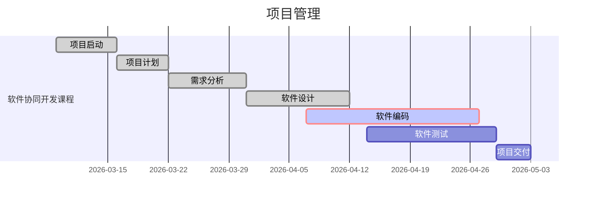
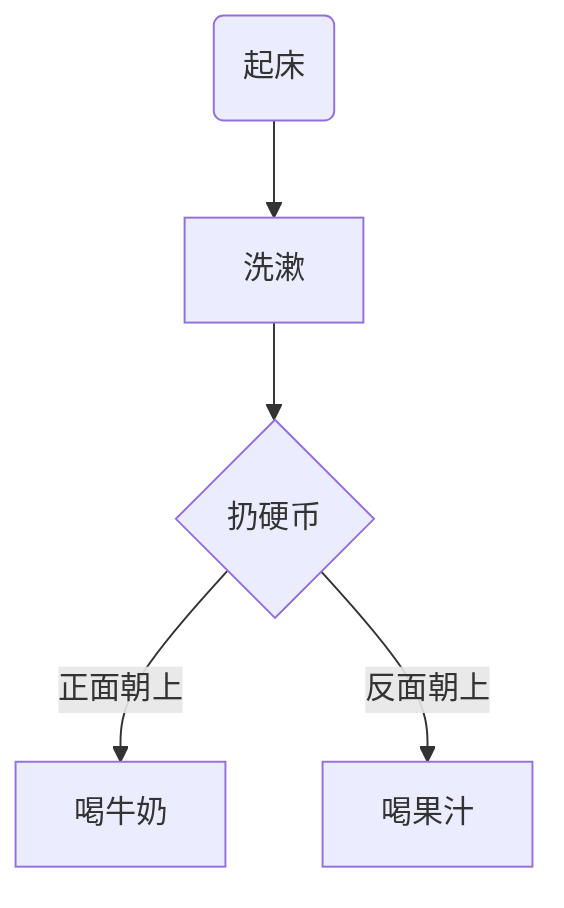
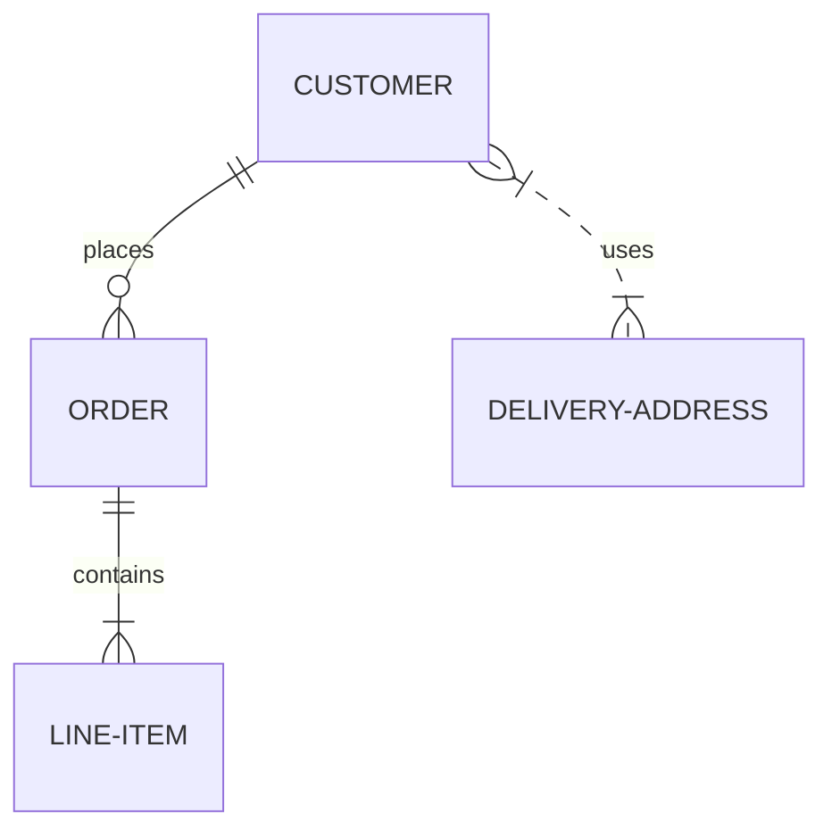
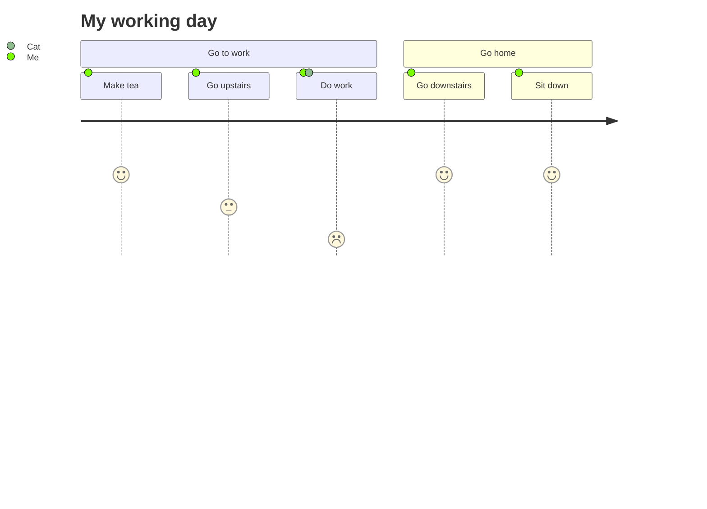

## 使用Mermaid做图

```mermaid
gantt
title 项目管理

dateFormat MM-DD

section 软件协同开发课程
项目启动 :done,des1,03-09,7d
项目计划 :done,des2,after des1,6d
需求分析 :done,des3,after des2,9d
软件设计 :done,des4,after des3,12d
软件编码 :crit,active,des5,04-07,20d
软件测试 :des6,04-14,15d
项目交付 :des7,after des6,4d
```

```mermaid
graph TD

A(起床) --> B[洗漱]

B --> C{扔硬币}

C -->|正面朝上| D[喝牛奶]

C -->|反面朝上| E[喝果汁]
```

```mermaid
erDiagram
    CUSTOMER ||--o{ ORDER : places
    ORDER ||--|{ LINE-ITEM : contains
    CUSTOMER }|..|{ DELIVERY-ADDRESS : uses
```

```mermaid
journey
    title My working day
    section Go to work
      Make tea: 5: Me
      Go upstairs: 3: Me
      Do work: 1: Me, Cat
    section Go home
      Go downstairs: 5: Me
      Sit down: 5: Me
```